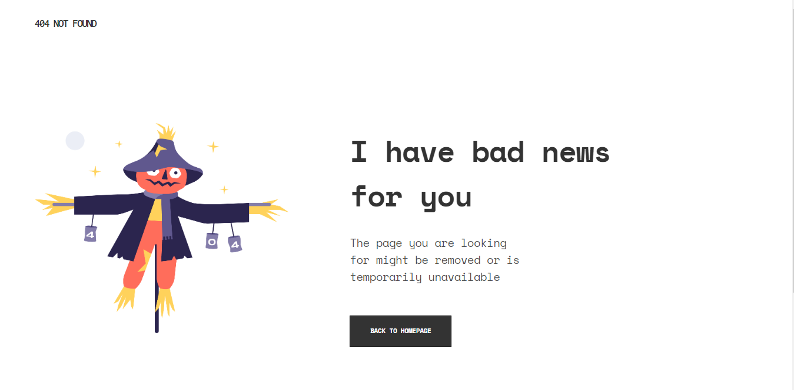

<h1 align="center"> 404 Not Found </h1>

Projeto desenvolvido pela devchallenges para ensino de tecnologias WEB.

  <a href="#-tecnologias">Tecnologias</a>&nbsp;&nbsp;&nbsp;|&nbsp;&nbsp;&nbsp;
  <a href="#-projeto">Projeto</a>&nbsp;&nbsp;&nbsp;|&nbsp;&nbsp;&nbsp;
  <a href="#-layout">Layout</a>&nbsp;&nbsp;&nbsp;|&nbsp;&nbsp;&nbsp;
  <a href="#memo-licença">Licença</a>

  

 

  

## 🚀 Tecnologias

Esse projeto foi desenvolvido com as seguintes tecnologias:

- HTML
- CSS

## 💻 Projeto

O projeto monsta um erro que esta havendo na página.

## 🔖 Layout

Você pode visualizar o layout do projeto através [DESSE LINK](https://www.figma.com/file/QeKWLNhB13zDjJzqR22TKE/404-page-challenge?node-id=0%3A1). É necessário ter conta no [Figma](https://figma.com) para acessá-lo.

Desenvolvedor Alexandre